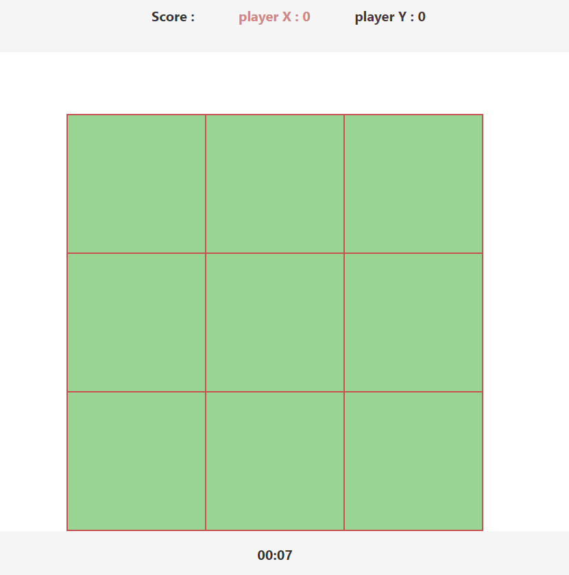
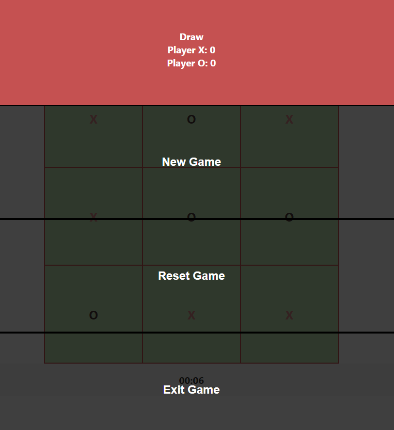
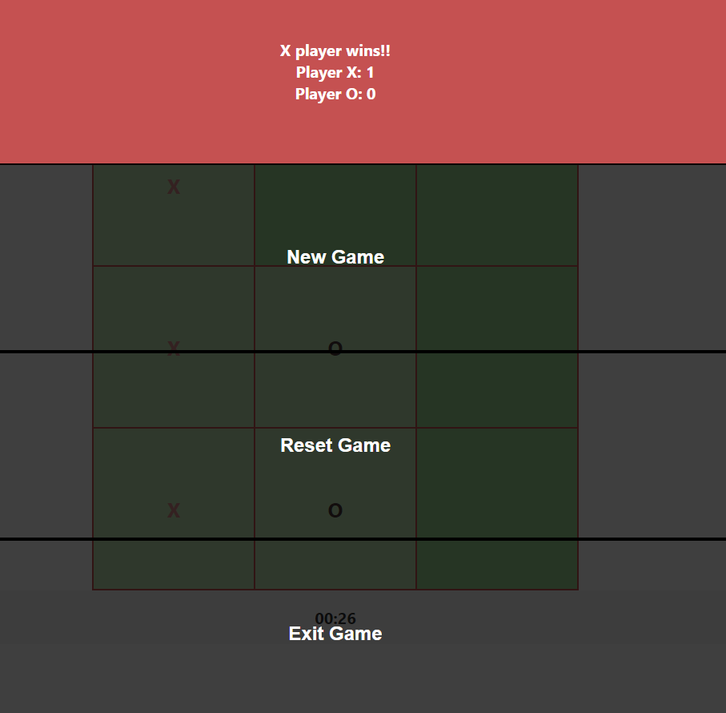

# XOX Game for Practicum

a simple xox game

## Run it on your computer

Clone the project

```
  git clone https://github.com/CihatKOCAK/xox-simple.git
```

Go to client directory and run

    ```
    cd xox-simple/client
    npm install
    npm start
    ```

or Yarn

    ```
    cd xox-simple/client
    yarn install
    yarn start
    ```

## Some Screenshots




